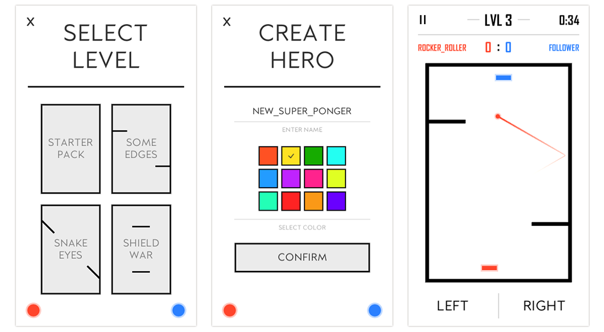

# Adaptive Ponger
Pong implementation where opponent constantly adapts to player strategy using neural network.

## Features
- Adaptive opponent
- Progressive difficulty
- Pong mechanics
- Custom machine learning model
- Load/Save system
- Duels between trained models

## Project Setup
- Build an apk and run on mobile or play directly in Unity editor

## Controls

- **Touch**: on mobile device
- **Mouse, A-D**: in unity editor
